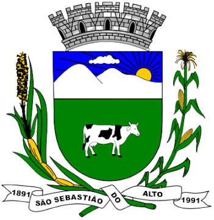

# 2021.1-Prefeitura Municipal de São Sebastião do Alto

  
  <figcaption>Figura 1 - Logo do site</figcaption>

 

&emsp;&emsp; Este repositório destina-se ao grupo 2 da matéria de Interação Humano-Computador da Universidade de Brasília. Possui o objetivo de analisar o site **[Prefeitura Municipal de São Sebastião do Alto](http://ssalto.rj.gov.br/)**, utilizando conceitos aprendidos na disciplina, ministrado pelo professor André Barros, durante o período 2021/1.

## Equipe
 Foto | Nome | Email | GitHub |
 ---- | ---- | ----- | ------ |
 | Gabriel Avelino	 | blackzinh8@gmail.com | [@gabrielavelino](https://github.com/gabrielavelino) |
 | Italo Serra	 | italoserra99@gmail.com | [@italofernandes13](https://github.com/italofernandes13) |
 | Pedro Lima	| phlimas@outlook.com | [@pedrolimass](https://github.com/pedrolimass) |
 | Philipe Serafim	| philipeserafim@gmail.com | [@philipeserafim](https://github.com/philipeserafim) |