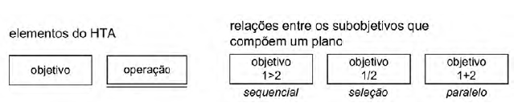
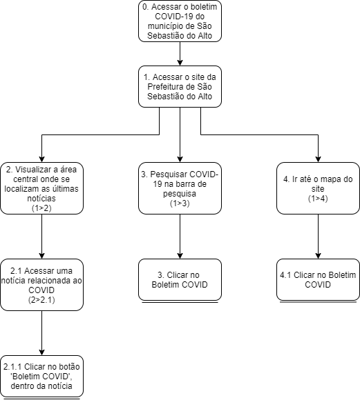
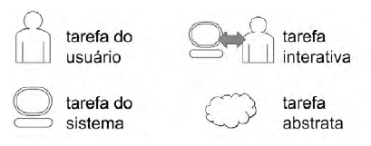
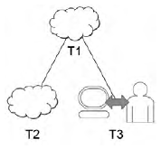

# Análise de tarefas

# Introdução

Como definido por Barbosa e Silva (2019): "Uma análise de tarefas é utilizada para se ter um entendimento sobre qual é o trabalho dos usuários, como eles o realizam e por quê.". Tendo essa referencia em mente a analise de tarefa tem como foco compreender as ações do usuário frente as funcionalidades do site da [Prefeitura de São Sebastião do Alto](http://ssalto.rj.gov.br/) para assim encontrar ponto a serem melhorados nas funcionalidades e na estética do mesmo. Essa analise será elaborada e abordada com o apoio de personas.
Vale ressaltar que para o projeto em questão analisado, buscou-se como foco principal definir como seria o fluxo de uso de um cidadão local em função das funcionalidades da página web.

# Análise Hierárquica de Tarefas

## Definição
A Análise Hierárquica de Tarefas (HTA - *Hierarchical Task Analysis*) tem como método captar os objetivos do usuário e decompor esses em subobjetivos. Os subobjetivos são alcançados por meio das devidas operações, que é a unidade fundamental do HTA. Segundo Barbosa e Silva (2019) o HTA vem para atender as competências e habilidades exibidas em tarefas que se apresentam como complexas, que por consequência auxilia na identificação de problemas de desempenho. 

## Metodologia
Para realizar a Análise de Tarefas, foram utilizados os desejos e anseios de cada persona para compor uma tarefa.
No HTA, uma <strong>tarefas</strong> é qualquer trabalho que precise ser realizado. Toda tarefa pode ser definida em função do seu objetivo, onde tarefas mais complexas são definidas em objetivos e subobjetivos. Os <strong>subojetivos</strong> são objetivos complexos que foram dissolvidos em objetivos melhores para que possam ter seu fluxo avaliado de uma melhor forma.

A especificação do relacionamento entre subojetivos é chamada de <strong>plano</strong>. Um plano pode definir três tipos de relacionamento entre os subobjetivos: sequencial (objetivo possuem uma ordem para serem atingidos), seleção (objetivo a ser atingido depende da circunstância) e paralelo (dois ou mais objetivos devem ser atingidos ao mesmo tempo). Por último tem-se a <strong>operação</strong>, que é o meio pelo qual um subobjetivo será atingido.

### Diagrama HTA
No diagrama de análise os objetivos e subobjetivos são representados por retângulos enquanto as operações são representadas por retângulos com uma linha abaixo, enquanto os relacionamentos são representados por números e símbolos que indicam os subobjetivos pertencentes ao relacionamento.

<figcaption>Figura 1 - Elementos de um diagrama HTA. Autor: Barbosa e Silva (2019)</figcaption>

### Tabela HTA
Além do diagrama, também é possível representar uma Análise de hierárquica de tarefas na forma de tabela, onde serão acrescentadas as informações sobre as circunstancias na qual uma operação foi realizada: <strong>ação</strong>, <strong>input</strong> e <strong>feedback</strong>.

## Resultados do HTA

### Ana Carolina

<figcaption>Figura 2 - <a href='./../../assets/img/hta_ana.png'>Diagrama HTA</a>. Autores: Philipe Serafim e Pedro Lima</figcaption>

| Objetivos e Operações                                                                             | Problemas e Recomendações                                                                 |
| :------------------------------------------------------------------------------------------------ | :---------------------------------------------------------------------------------------- |
| 0. Acessar as novas leis, decretos, concursos e licitações municipais, bem como decretos oficiais | Recomendações: indicar qual contexto o usuário se encontra e o caminho percorrido por ele |
| 1. Acessar o site da Prefeitura de São Sebastião do Alto                                          | input: endereço do site                                                                   |
| 2. Na barra de navegação, selecionar o item desejado                                              |                                                                                           |
| 3. Ir até o mapa do site (3>1)                                                                    | plano: acessar o site para então ir até a página especificada                             |
| 3.1 Clicar em 'leis municipais'                                                                   |                                                                                           |
| 3.2 Clicar em 'diário oficial'                                                                    |                                                                                           |
| 3.3 Clicar em 'licitações municipais'                                                             |                                                                                           |
| 3.4 Clicar em 'decretos municipais'                                                               |                                                                                           |
| 4. Pesquisar o item (1>4)                                                                         | input: digitar o item desejado na barra de pesquisa                                       |
| 4.1 Clicar no item desejado                                                                       |                                                                                           |
<figcaption> Tabela 1 - Tabela HTA. Autores: Philipe Serafim e Pedro Lima</figcaption>

### Carlos Silva

<figcaption>Figura 3 - <a href='./../../assets/img/hta_carlos.png'>Diagrama HTA</a>. Autores: Philipe Serafim e Pedro Lima</figcaption>

| Objetivos e Operações                                    | Problemas e Recomendações                                                                                       |
| :------------------------------------------------------- | :-------------------------------------------------------------------------------------------------------------- |
| 0. Acessar as últimas notícias e eventos do município    | recomendação: ordenado com as mais recentes primeiro                                                            |
| 1. Acessar o site da Prefeitura de São Sebastião do Alto | input: endereço do site                                                                                         |
| 2. Navegar pela área de últimas publicações (1>2)        | plano: acessar site para então ir até a área citada                                                             |
| 2.1 Clicar em 'todas as notícias'                        |                                                                                                                 |
| 3. Ir até o mapa do site (1>3)                           | plano: acessar site para então ir até a área citada                                                             |
| 3.1 Clicar em 'Notícias'                                 |                                                                                                                 |
| 3.2 Clicar em 'Eventos'                                  |                                                                                                                 |
| 4. Na barra de navegação, clicar no item desejado(1>4)   | plano: acessar site para então ir até a área citada recomendação: organizar os eventos ded forma cronológica |
| 4.1 Clicar no evento desejado                            |                                                                                                                 |
<figcaption> Tabela 2 - Tabela HTA. Autores: Philipe Serafim e Pedro Lima</figcaption>

### Maria Tereza

<figcaption>Figura 4 - <a href='./../../assets/img/hta_maria.png'>Diagrama HTA</a>. Autores: Philipe Serafim e Pedro Lima</figcaption>

| Objetivos e Operações                                                     | Problemas e Recomendações                                                                       |
| :------------------------------------------------------------------------ | :---------------------------------------------------------------------------------------------- |
| 0. Acessar o boletim COVID-19 do município                                | recomendação: uma página exclusiva devido a seriedade e magnitude da informação                 |
| 1. Acessar o site da Prefeitura de São Sebastião do Alto                  | input: endereço do site                                                                         |
| 2. Visualizar na área central, onde se localiza as últimas notícias (1>2) | plano: acessar site para então ir até a área                                                    |
| 2.1 Acessar uma notícia relacionada ao COVID (2>2.1)                      | plano: navegar pela área de últimas notícias e selecionar uma relacionada ao COVID              |
| 2.2 Clicar no 'Boletim COVID-19' dentro da notícia                        |                                                                                                 |
| 3. Pesquisar na página (1>3)                                              | input: digitar COVID na barra de pesquisa plano: acessar site para então utilizar a pesquisa |
| 3.1 Clicar no 'Boletim COVID-19'                                          |                                                                                                 |
| 4. Ir até o mapa do site(3>1)                                             | plano: acessar o site para então ir até a página especificada                                   |
| 4.1 Clicar no Boletim-COVID                                               |                                                                                                 |
<figcaption> Tabela 3 - Tabela HTA. Autores: Philipe Serafim e Pedro Lima</figcaption>

---
# Árvore de Tarefas Concorrentes
 O modelo de árvores de tarefas concorrentes (ConcurTaskTrees – CTT) foi criado para auxiliar a avaliação e o design e avaliação de IHC (Paternò, 2000).
 No modelo CTT, existem quatro tipos de tarefas:

 |          Tipo          | Descrição                                                                                                             |
 | :--------------------: | :-------------------------------------------------------------------------------------------------------------------- |
 |   tarefas do usuário   | realizadas fora do sistema                                                                                            |
 |   tarefas do sistema   | quando o sistema realiza um processamento sem interagir com o usuário                                                 |
 | tarefas do interativas | quando ocorrem diálogos usuários-sistema                                                                              |
 |  tarefas do abstratas  | que não são tarefas propriamente ditas, mas uma representação de uma composição de tarefas que auxilia a decomposição |

 <figcaption>Tabela 4 - Tarefas do CTT. Fonte: Barbosa e Silva, 2010</figcaption>

## Definição

 Assim como na HTA, as tarefas possuem diferentes níveis hierárquicos, onde tarefas descendentes devem ser concluídas para que as tarefas ascendentes possam ser realizadas. Além das diferenças hierárquicas, o modelo CTT também possui elementos de representação próprios:

 
 <figcaption>Figura 5 - Elementos do diagrama CTT. Fonte: Barbosa e Silva, 2010</figcaption>
 
 
 <figcaption>Figura 6 - Representação hierárquica do diagrama CTT. Fonte: Barbosa e Silva, 2010</figcaption>

Além da hierarquia, o CTT permite relacionamento entre as tarefas, que podem ser dos tipos:

|                Nome                 | Representação | Descrição                                                                                       |
| :---------------------------------: | :-----------: | :---------------------------------------------------------------------------------------------- |
|              Ativação               |    T1>>T2     | A T2 só pode iniciar após T1 ser concluída                                                      |
| Ativação com passagem de informação |   T1[]>>T2    | A T2 só pode iniciar após T1 ser concluída e a informação de T1 é passada para T2               |
|               Escolha               |    T1[]T2     | Duas tarefas estarão habilitadas, mas assim que uma é escolhida a outra será desabilitada       |
|        Tarefas concorrentes         |  T1\|\|\|T2   | As tarefas podem ser realizadas em qualquer ordem ou ao mesmo tempo                             |
| Tarefas concorrentes e comunicantes |  T1\|[]\|T2   | As tarefas podem ser realizadas em qualquer ordem ou ao mesmo tempo, e podem trocar informações |
|        Tarefas independentes        |   T1\|=\|T2   | As tarefas podem ser realizadas em qualquer ordem, mas não podem ser realizadas ao mesmo tempo  |
|             Desativação             |    T1[>T2     | A T1 pode ser interrompida por T2                                                               |
|         Suspensão/retomada          |    T1\|>T2    | A T1 pode ser interrompida por T2 e é retomada assim que T2 terminar                            |

<figcaption>Tabela 5 - Relacionamentos do CTT. Fonte: Barbosa e Silva, 2010</figcaption>

---
# GOMS
## Definição

 A família GOMS (Goals, Operators, Methods, and Selection Rules - Objetivos, Operadores, Métodos e Regras de Seleção), foi proposta por Card, Moran & Newell em 1983, para "analisar o desempenho de usuário competentes de sistemas computacionais, realizando tarefas dentro da sua competência e sem cometer erros" (Barbosa e Silva, 2010). No geral, sistemas são projetados considerando que seus usuários se tornem eficientes ao realizar tarefas rotineiras. Com isso, os modelos GOMS se revelaram úteis para prever desempenho e impacto de decisões de design.

 O método GOMS descreve uma tarefa e/ou conhecimento técnico do usuário em:
  - objetivo (goals) - o que o usuário quer realizar
  - operadores (operators) - primitivas internas (cognitivas), ou externas (ações concretas realizadas que permitem que o usuário realize ações como digitar parâmetros no teclado)
  - métodos (methods) - sequências bem conhecidas de subobjetivos e operadores que permitem atingir um objetivo maior
  - regras de seleção (selection rules) - representam tomadas de decisão sobre quais métodos o usuário poderá utilizar em uma determinada situação

O GOMS pode ser utilizado tanto de forma quantitativa, fornecendo estimativas de quanto tempo será necessário para se realizar uma tarefa,  quanto de forma qualitativa, auxiliando na elaboração de treinamentos, sistemas de ajuda e tutoriais. A análise requer que o designer possua uma lista de objetivos iniciais do usuários, que podem ser obtidas através de entrevistas e observações de sistemas existentes ou semelhantes. Dos modelos da família  GOMS destacaremos o KLM.

## KLM

O KLM é a técnica mais simples, nessa técnica existe um conjunto predefinido de operadores primitivos:
  - K - pressionar tecla ou botão
  - P - apontar com o mouse um alvo no dispositivo visual
  - H - mover as mãos para o teclado ou outro dispositivo
  - D - desenha um segmento de reta em um grid
  - M - se preparar mentalmente para realizar uma ou mais ações primitivas fortemente relacionadas entre si
  - R - tempo de resposta do sistema no qual o usuário precisa esperar

Com isso, podemos dissecar uma ação do usuário em várias etapas de acordo com os operadores e fazer estimativas e comparações do tempo de execução de uma tarefa.

---
# Conclusões

Observando os métodos de análise citados, é percebido que cada método produz uma métrica diferente com relação a tarefa que está sendo analisada. Onde os métodos HTA e CTT produzem esquemas que podem ser utilizados para otimizar a conclusão de uma tarefa visto que eles dissecam as tarefas em etapas de modo a evidenciar etapas que poderiam ser evitadas de alguma forma, enquanto as análises da família GOMS consegue determinar quais etapas da tarefa estão utilizando mais tempo que o ideal, e com isso, identificar possíveis candidatos a receberem facilitados e/ou atalhos.

---

# Bibliografias

  BARBOSA S. D. J.; SILVA B. S. <strong>Interação Humano-Computador</strong> ed. Elsevier, 2010.
  
  Paternò, F. Model-Based Design and Evaluation of Interactive Applications. London, UK: Springer-Verlag, 1999.

# Versionamento

|    Data    | Versão |                             Alteração                              |             Responsável(eis)             |
| :--------: | :----: | :----------------------------------------------------------------: | :--------------------------------------: |
| 26/08/2021 |  1.0   |                         Análise de tarefas                         | Pedro Lima Philipe Serafim (revisor) |
| 27/08/2021 |  1.1   |                       Complementação do HTA                        |             Philipe Serafim              |
| 27/08/2021 |  1.2   |                Criação dos diagramas e tabelas HTA                 |             Philipe Serafim              |
| 02/09/2021 |  1.3   |         Realização das correção indicadas na apresentação          |             Philipe Serafim              |
| 02/09/2021 |  1.4   | Adicionado documento de Análise com Árvore de Tarefas Concorrentes |             Philipe Serafim              |
| 02/09/2021 |  1.4   |          Adicionado documento de Análise GOMS e conclusão          |             Philipe Serafim              |