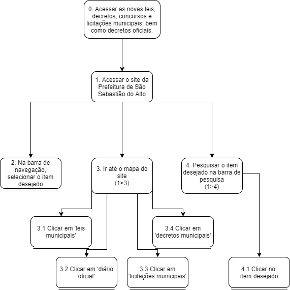
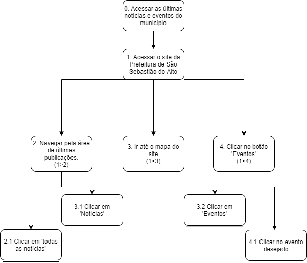

# Análise de tarefas

## Introdução

Como definido por Barbosa e Silva (2019): "Uma análise de tarefas é utilizada para se ter um entendimento sobre qual é o trabalho dos usuários, como eles o realizam e por quê.". Tendo essa referencia em mente a analise de taréfa tem como foco compreender as ações do usuário frente as funcionalidades do site da [Prefeitura de São Sebastião do Alto](http://ssalto.rj.gov.br/) para assim encontrar ponto a serem melhorados nas funcionalidades e na estética do mesmo. Essa analise será elaborada e abordada com o apoio de personas.
Vale ressaltar que para o projeto em questão analisado, buscou-se como foco principal definir como seria o fluxo de uso de um cidadão local em função das funcionalidades da página web.

## Análise Hierárquica de Tarefas

### Definição
A Análise Hierárquica de Tarefas (HTA - *Hierarchical Task Analysis*) tem como método captar os objetivos do usuário e decompor esses em subobjetivos. Os subobjetivos são alcançados por meio das devidas operações, que é a unidade fundamental do HTA. Segundo Barbosa e Silva (2019) o HTA vem para atender as competências e habilidades exibidas em tarefas que se apresentam como complexas, que por consequência auxilia na identificação de problemas de desempenho. 

### Metodologia
Para realizar a Análise de Tarefas, foram utilizados os desejos e anseios de cada persona para compor uma tarefa.
No HTA, uma <strong>tarefas</strong> é qualquer trabalho que precise ser realizado. Toda tarefa pode ser definida em função do seu objetivo, onde tarefas mais complexas são definidas em objetivos e subobjetivos. Os <strong>subojetivos</strong> são objetivos complexos que foram dissolvidos em objetivos melhores para que possam ter seu fluxo avaliado de uma melhor forma.

A especificação do relacionamento entre subojetivos é chamada de <strong>plano</strong>. Um plano pode definir três tipos de relacionamento entre os subobjetivos: sequencial (objetivo possuem uma ordem para serem atingidos), seleção (objetivo a ser atingido depende da circunstância) e paralelo (dois ou mais objetivos devem ser atingidos ao mesmo tempo). Por último tem-se a <strong>operação</strong>, que é o meio pelo qual um subobjetivo será atingido.

#### Diagrama HTA
No diagrama de análise os objetivos e subobjetivos são representados por retângulos enquanto as operações são representadas por retângulos com uma linha abaixo, enquanto os relacionamentos são representados por números e símbolos que indicam os subobjetivos pertencentes ao relacionamento.

<figcaption>Figura 1 - Elementos de um diagrama HTA. Autor: Barbosa e Silva (2019)</figcaption>

### Tabela HTA
Além do diagrama, também é possível representar uma Análise de hierárquica de tarefas na forma de tabela, onde serão acrescentadas as informações sobre as circunstancias na qual uma operação foi realizada: <strong>ação</strong>, <strong>input</strong> e <strong>feedback</strong>.

## Resultados

### Ana Carolina

<figcaption>Figura 2 - Diagrama HTA. Autores: Philipe Serafim e Pedro Lima</figcaption>

| Objetivos e Operações                                                                             | Problemas e Recomendações                                                                 |
| :------------------------------------------------------------------------------------------------ | :---------------------------------------------------------------------------------------- |
| 0. Acessar as novas leis, decretos, concursos e licitações municipais, bem como decretos oficiais | Recomendações: indicar qual contexto o usuário se encontra e o caminho percorrido por ele |
| 1. Acessar o site da Prefeitura de São Sebastião do Alto                                          | input: endereço do site                                                                   |
| 2. Na barra de navegação, selecionar o item desejado                                              |                                                                                           |
| 3. Ir até o mapa do site (3>1)                                                                    | plano: acessar o site para então ir até a página especificada                             |
| 3.1 Clicar em 'leis municipais'                                                                   |                                                                                           |
| 3.2 Clicar em 'diário oficial'                                                                    |                                                                                           |
| 3.3 Clicar em 'licitações municipais'                                                             |                                                                                           |
| 3.4 Clicar em 'decretos municipais'                                                               |                                                                                           |
| 4. Pesquisar o item (1>4)                                                                         | input: digitar o item desejado na barra de pesquisa                                       |
| 4.1 Clicar no item desejado                                                                       |                                                                                           |
<figcaption> Tabela 1 - Tabela HTA. Autores: Philipe Serafim e Pedro Lima</figcaption>

### Carlos Silva

<figcaption>Figura 3 - Diagrama HTA. Autores: Philipe Serafim e Pedro Lima</figcaption>

| Objetivos e Operações                                    | Problemas e Recomendações                                                                                       |
| :------------------------------------------------------- | :-------------------------------------------------------------------------------------------------------------- |
| 0. Acessar as últimas notícias e eventos do município    | recomendação: ordenado com as mais recentes primeiro                                                            |
| 1. Acessar o site da Prefeitura de São Sebastião do Alto | input: endereço do site                                                                                         |
| 2. Navegar pela área de últimas publicações (1>2)        | plano: acessar site para então ir até a área citada                                                             |
| 2.1 Clicar em 'todas as notícias'                        |                                                                                                                 |
| 3. Ir até o mapa do site (1>3)                           | plano: acessar site para então ir até a área citada                                                             |
| 3.1 Clicar em 'Notícias'                                 |                                                                                                                 |
| 3.2 Clicar em 'Eventos'                                  |                                                                                                                 |
| 4. Na barra de navegação, clicar no item desejado(1>4)   | plano: acessar site para então ir até a área citada recomendação: organizar os eventos ded forma cronológica |
| 4.1 Clicar no evento desejado                            |                                                                                                                 |
<figcaption> Tabela 2 - Tabela HTA. Autores: Philipe Serafim e Pedro Lima</figcaption>

### Maria Tereza

<figcaption>Figura 4 - Diagrama HTA. Autores: Philipe Serafim e Pedro Lima</figcaption>

| Objetivos e Operações                                                     | Problemas e Recomendações                                                                       |
| :------------------------------------------------------------------------ | :---------------------------------------------------------------------------------------------- |
| 0. Acessar o boletim COVID-19 do município                                | recomendação: uma página exclusiva devido a seriedade e magnitude da informação                 |
| 1. Acessar o site da Prefeitura de São Sebastião do Alto                  | input: endereço do site                                                                         |
| 2. Visualizar na área central, onde se localiza as últimas notícias (1>2) | plano: acessar site para então ir até a área                                                    |
| 2.1 Acessar uma notícia relacionada ao COVID (2>2.1)                      | plano: navegar pela área de últimas notícias e selecionar uma relacionada ao COVID              |
| 2.2 Clicar no 'Boletim COVID-19' dentro da notícia                        |                                                                                                 |
| 3. Pesquisar na página (1>3)                                              | input: digitar COVID na barra de pesquisa plano: acessar site para então utilizar a pesquisa |
| 3.1 Clicar no 'Boletim COVID-19'                                          |                                                                                                 |
| 4. Ir até o mapa do site(3>1)                                             | plano: acessar o site para então ir até a página especificada                                   |
| 4.1 Clicar no Boletim-COVID                                               |                                                                                                 |
<figcaption> Tabela 3 - Tabela HTA. Autores: Philipe Serafim e Pedro Lima</figcaption>

### Bibliografias

  BARBOSA S. D. J.; SILVA B. S. <strong>Interação Humano-Computador</strong> ed. Elsevier, 2010.

## Versionamento

|    Data    | Versão |                     Alteração                     |             Responsável(eis)             |
| :--------: | :----: | :-----------------------------------------------: | :--------------------------------------: |
| 26/08/2021 |  1.0   |                Análise de tarefas                 | Pedro Lima Philipe Serafim (revisor) |
| 27/08/2021 |  1.1   |               Complementação do HTA               |             Philipe Serafim              |
| 27/08/2021 |  1.2   |        Criação dos diagramas e tabelas HTA        |             Philipe Serafim              |
| 02/09/2021 |  1.3   | Realização das correção indicadas na apresentação |             Philipe Serafim              |