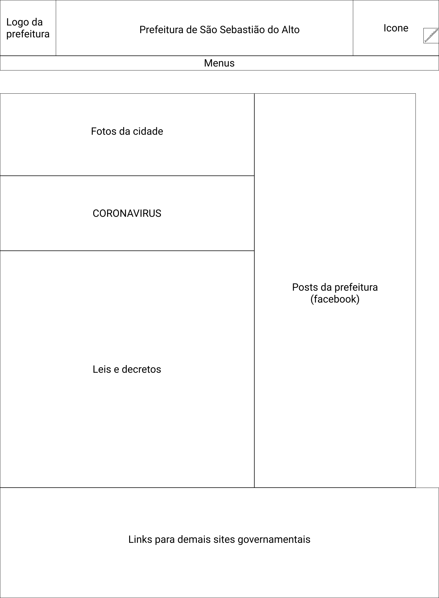

# Guia de Estilo

# Introdução
O guia de estilo tem como objetivo documentar as decisões que buscam aplicar soluções voltadas a um design coerente as demandas do site [Prefeitura de São Sebastião do Alto](http://ssalto.rj.gov.br/). Esse documento terá como foco os princípios e as diretrizes adotadas na matéria de Interação Humano-Computador, para que assim exista um eficiência tanto na consulta quanto na reutilização das escolhas.

  

<figcaption>Figura1: Análise de Requisitos do Ciclo de Mayhew. Modificado por: Eduarda Servidio. Fonte: BARBOSA, 2010</figcaption>

## Objetivo do Guia de Estilo
A guia tem que ser vista como ferramenta e meio de comunicação mais eficiente entre a equipe de design e o time de desenvolvimento. Vale ressaltar que as decisões de design devem estar facilmente acessíveis a consultadas e assim permitindo sua reutilização nas discussões e alterações futuras.
Tendo isso como ponto de partida, construiremos a guia de estilo com o objetivo de registrar as decisões de design para o projeto.

## Organização 

A guia de estilo seguirá a estrutura definida por Marcus e Mayhew (Marcus, 1992; Mayhew, 1999):

- 1. Introdução  
       - 1.1. Objetivo do guia de estilo
       - 1.2. Organização e conteúdo do guia de estilo
       - 1.3. Público-alvo do guia de estilos (programadores, gerentes, equipe de suporte)
       - 1.4. Como utilizar o guia (em produção e manutenção)
       - 1.5. Como manter o guia
- 2. Resultados de análise 
       - 2.1. Descrição do ambiente de trabalho do usuário
- 3. Elementos de interface 
       - 3.1. Disposição espacial e grid
       - 3.2. Janelas
       - 3.3. Tipografia
       - 3.4. Símbolos não tipográficos
       - 3.5. Cores
       - 3.6. Animações
- 4. Elementos de interação 
       - 4.1. Estilos de interação
       - 4.2. Seleção de um estilo
       - 4.3. Aceleradores (teclas de atalho)
- 5. Elementos de ação 
       - 5.1. Preenchimento de campos 
       - 5.2. Seleção
       - 5.3. Ativação
- 6. Vocabulário e padrões 
       - 6.1. Terminologia
       - 6.2. Tipos de tela (para tarefas comuns)
       - 6.3. Sequências de diálogos

## Público-alvo do Guia de Estilos

O público-alvo consiste nas equipes desenvolvimento e a equipe que está dedicada ao design do produto em questão.

## Como utilizar o Guia

Está documentação deve utilizado como material de apoio ao processo de design e evolução, e nunca como regra fixa para demandas futuras. As correções e melhorias necessárias ao design do produto devem sempre ser atualizadas de acordo com suas ocorrências.

## Como manter o Guia

A guia deve ser estar sempre atualizado de acordo com as alterações e recomendações necessárias ao projeto. Seguindo sempre o fluxo do Ciclo de vida de Mayhew.

# Resultados de Análise
## Ambiente de trabalho do usuário

O site do da Prefeitura de são Sebastião do Alto é um ambiente voltado a apresentar as principais notícias e viabilizar um melhor acesso a demandas publicas de nível estadual a nacional. Na tela Home o primeiro contado permite ter acesso a essas informações. O menu possui 6 links de acesso a outras partes da plataforma sobre a Administração da cidade, serviços administrativos e informações municipais e estaduais. Existe também um menu móvel lateral que viabiliza a recursos de acessibilidade.

Abaixo uma imagem do site da [Prefeitura de São Sebastião do Alto](http://ssalto.rj.gov.br/), em especifico a aba Superior da página Home:

<figcaption>Figura 2 - Site da Prefeitura de São Sebastião do Alto. Disponível em: <a href='http://ssalto.rj.gov.br/'>Prefeitura de São Sebastião do Alto</a></figcaption>

---

<figcaption>Figura 3 - Menus de navegação. Disponível em: <a href='http://ssalto.rj.gov.br/'>Prefeitura de São Sebastião do Alto</a></figcaption>

---
# Elementos de interface
## Disposição dos elementos e grid

A disposição dos itens no site é simples, mas não apresenta uma hierarquia lógica de informação. O primeiro link para uma lei na página, é datado em 1992 para então apresentar as leis e decretos mais recentes. Faz uso de prints de decretos e links sem uma lógica definida. O iframe do Facebook da Prefeitura percorre toda a página verticalmente.

<figcaption>Figura 4 - Grid da página inicial</figcaption>

<figcaption>Figura 5 - Grid da página de notícias</figcaption>

## Páginas

No total, existem 24 páginas incluindo a página inicial, que seguem a distribuição e grid já citados. São elas:
  - HOME
  - ADMINISTRAÇÃO MUNICIPAL
    - SECRETARIAS MUNICIPAIS
    - PROCESSO SELETIVO 
    - LEGISLAÇÃO
  - SOBRE O MUNICÍPIO DE SÃO SEBASTIÃO DO ALTO
    - SOBRE O MUNICÍPIO 
    - DADOS GERAIS
    - NOSSA HISTÓRIA
  - SERVIÇOS
    - CONTRACHEQUE ONLINE
    - NFS-e (NOTA FISCAL DE SERVIÇOS ELETRÔNICA)
    - IPTU – 2ª VIA
    - JUCERJA – REGIN
    - LINKS ÚTEIS
    - WEBMAIL
  - ACESSO À INFORMAÇÃO
    - LEI DE ACESSO À INFORMAÇÃO DO MUNICÍPIO DE SÃO SEBASTIÃO DO ALTO
    - PORTAL DA TRANSPARÊNCIA
    - LICITAÇÕES
    - AUDIÊNCIAS PÚBLICAS
    - ENTENDA A LAI (LEI DE ACESSO À INFORMAÇÃO)
    - PEÇA UMA INFORMAÇÃO
    - RECURSOS: PASSO-A-PASSO
    - SAIBA MAIS
    - FORMULÁRIOS SIC
    - OUVIDORIA

## Tipografia

Os textos presentes, utilizam a fonte Lato.

<figcaption>Figura 6 - Exemplos de utilização da fonte Lato</figcaption>

Entretanto, as diversas imagens distribuídas ao longo do site, utilizam outras fonte como Arial, Calibri e Times New Roman.

## Símbolos não tipográficos

O site não apresenta nenhuma simbologia específica, utilizando apenas a lupa para barra de pesquisa e os símbolos contidos no menu de acessibilidade.

<figcaption>Figura 7 - Símbolos do menu de acessibilidade e da barra de pesquisa</figcaption>

## Cores

<figcaption>Figura 8 - Cores da Logo</figcaption>

<figcaption>Figura 9 - Core principais</figcaption>

<figcaption>Figura 10 - Cores secundárias</figcaption>

## Animações

O site  <a href='http://ssalto.rj.gov.br/'>Prefeitura de São Sebastião do Alto</a> não apresenta nenhuma animação.

# Elementos de interação
## Estilos de interação
O site contém apenas o menu do estilo de interação WIMP(Windows, Icons, Menus, and Pointers), que é a utilização de janelas, ícones, menus e ações com mouse focadas facilitar a navegação do usuário.

## Seleção de um Estilo
O único estilo presente no site, é o de menus, que possibilita a rápida navegação entre as páginas.
## Aceleradores (teclas de atalho)
Não foram encontrados aceleradores e nem atalhos. Caso existam não existe nenhuma informação indicando.
# Elementos de ação
## Preenchimento de campos
O site não possui campos a serem preenchidos.

## Seleção

Na página inicial, a maioria dos itens é composta por imagens com links, dificultado a seleção dos textos e objetos. Entretanto, todos os elementos do site são selecionáveis.
## Ativação

O site não possui nenhuma ação na qual seja necessária a realização de ativação ou autenticação.

# Vocabulário e padrões

## Terminologia
O site apresenta uma carga terminológica muito presente no judiciário, devido ao fluxo de leis e decretos que são publicados.
## Sequências de diálogos
O site não apresenta nenhuma sequencia de diálogos, tornando-o 100% informativo e unilateral.

## Padrão das telas

O site possui cabeçalho, menus e rodapés presentes em todas as páginas.

<figcaption>Figura 11 - Cabeçalho e menus</figcaption>

<figcaption>Figura 12 - Rodapé</figcaption>

# Bibliografias

  BARBOSA S. D. J.; SILVA B. S. <strong>Interação Humano-Computador</strong> ed. Elsevier, 2010.

# Versionamento

 | **Data**   | **Versão** | **Descrição**            |             **Autor(es)**              |
 | ---------- | :--------: | ------------------------ | :------------------------------------: |
 | 03/09/2021 |    1.0     | Criação do Documento     | Pedro Lima e Philipe Serafim (revisor) |
 | 03/09/2021 |    1.1     | Adição do guia de estilo | Philipe Serafim e Pedro Lima (revisor) |
 