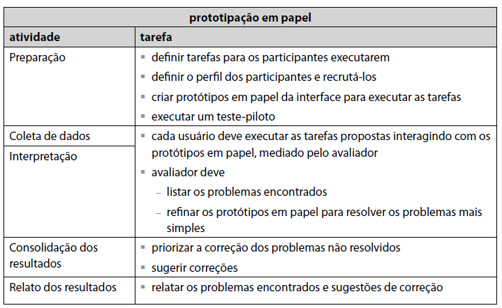

# Planejamento da Avaliação

## Introdução
O método de prototipação em papel (Snyder, 2003) avalia a usabilidade de um design de IHC representado em papel, através de simulações de  uso com a participação de potenciais usuários (Barbosa e Silva, 2010). Ainda seguindo o roteiro da prototipação em papel apresentada, será realizado o teste-piloto, a coleta e interpretação dos dados e consolidação e relato dos resultados.
## Metodologia
A prototipação em papel, realiza a simulação de uso com participação dos potenciais usuários. A prototipação em papel pode ser dividida em etapas, conforme descrito no livro Interação Humano-Computador, 2010.

<figcaption>Tabela 1 - Prototipação em papel. Fonte: Barbosa e Silva (2010).

### Preparação
Primeiro foi definido que as tarefas a serem executadas serão as mesmas tarefas utilizadas na [Análise Hierárquica de Tarefas](../../docs/proj/analiseDeTarefas.md):
  - Acessar as novas leis, decretos, concursos e licitações, bem como decretos oficiais.
  - Acessar notícias e eventos do município
  - Acessar o boletim COVID-19 do município de São Sebastião do Alto

O perfil dos usuários do site já foi definido previamente com o auxílio das [Personas](../../docs/proj/../../assets/img/perfildeusuario.png), entretanto, para realizar a avaliação apenas o Carlos Silva e a Maria Tereza foram recrutados.

### Coleta e interpretação dos dados
Antes dos usuários iniciarem as tarefas indicadas, foi necessário verificar se eles tinham conhecimento do que iriam realizar e se consentiam com isso através do termo de consentimento:

>Nós do grupo 2 da disciplina de Interação Humano Computador da Universidade de Brasília, e queremos fazer uma análise de usabilidade através de um protótipo de papel, para que desta maneira a remodelagem do sistema do site da Prefeitura do São Sebastião do Alto fique melhor à sua comunidade. Sendo assim, é necessário saber mais das necessidades, vontades e expectativas das pessoas que utilizam deste site através de uma série de perguntas. Solicitamos o seu consentimento para realizarmos algumas perguntas por meio da realização de algumas tarefas utilizando o protótipo e um entrevista, e para, realmente, decidir sobre o consentimento, é preciso que saiba as seguintes informações em relação a pesquisa:
><ul>
><li> Os dados coletados durante a entrevista destinam-se estritamente a atividades de análise e desenvolvimento do estudo acerca das interações com o usuário feitas durante o uso do sistema. </li>
><li> A entrevista pode ser interrompida a qualquer momento, segundo a sua disponibilidade e vontade. </li>
><li> O consentimento para a entrevista é uma escolha livre, feita mediante a prestação de todos os esclarecimentos necessários sobre a pesquisa. </li>
><li> Nossa equipe tem o compromisso de divulgar os resultados de nossas pesquisas para o docente. A divulgação desses resultados pauta-se no respeito à sua privacidade, e a preservação de seus dados pessoais serão preservados em quaisquer documentos que elaborarmos, apenas utilizando da sua identificação básica, nome e idade, e ocupação. </li>
><li> Nossa equipe encontra-se disponível para contato através do e-mail 180100831@aluno.unb.br. </li>
></ul>
>Depois de passado todas essa informações, desejamos que você fale em alto e bom som umas das seguinte alternativas:
><ul>
><li> Eu, (seu nome) não consinto com a sua realização. </li>
><li> Eu, (seu nome) dou meu consentimento para a sua realização. </li>
><ul>

Após consentirem, os usuários recrutados começaram a interagir com o protótipo e o avaliador irá observar e anotar os problemas encontrados e os feedback do usuário. Ao final, o avaliador fará uma breve entrevista para que seja possível compreender os sentimentos e necessidades do usuário enquanto realizava as tarefas no protótipo.

|  ID   | Pergunta                                                                                                                  |
| :---: | :------------------------------------------------------------------------------------------------------------------------ |
|  P01  | Você encontrou alguma dificuldade na realização das tarefas? Se sim, qual?                                                |
|  P02  | Comparando a realização da tarefa no site real e no protótipo, qual dos dois você escolheria para continuar utilizando?   |
|  P03  | Você possui alguma crítica ao protótipo? E sugestão?                                                                      |
|  P04  | Comparando o tempo levado para realizar as tarefas no site e no protótipo, qual passa o sentimento de ser mais eficiente? |
|  P05  | Ao realizar as tarefas no protótipo, era possível manter o foco na tarefa?                                                |

### Resultados

Baseado nas anotações do avaliador e nas respostas de cada usuário, deve-se identificar os problemas para então solucioná-los e sugerir possíveis correções a serem adicionadas no protótipo e consequentemente alteradas no design do produto.

## Bibliografia
Barbosa, S. D. J.; Silva, B. S. da; Silveira, M. S.; Gasparini, I.; Darin, T.; Barbosa, G. D. J. (2021) Interação Humano-Computador e Experiência do usuário. Autopublicação.
## Versionamento

| Versão | Data       | Modificação                    | Autor           |
| ------ | ---------- | ------------------------------ | --------------- |
| 1.0    | 17/09/2021 | Criação do Documento           | Pedro Lima      |
| 1.1    | 17/09/2021 | Adição das etapas da avaliação | Philipe Serafim |