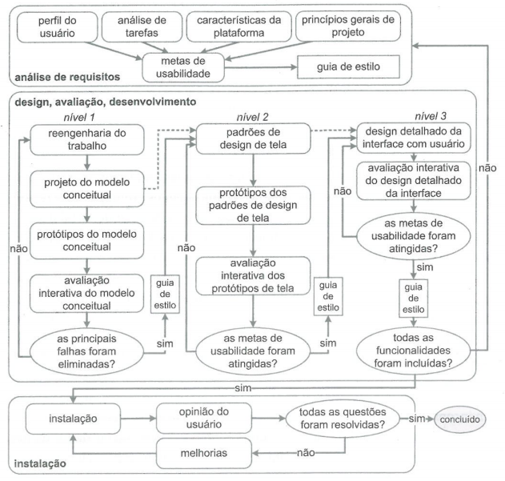

# Processo de Design 

## Usabilidade de Mayhew 

### Introdução 

O design de processo é uma operação muito importante, porque através dele fazemos a análise da situação atual, a síntese de uma intervenção e a avaliação dessa intervenção projetada ou já aplicada à situação atual. Sendo assim, conhecer este processo é algo fundamental, pois cada processo dessa atividade básica têm uma maneira particular para detalhar as atividades básicas, como executar cada atividade, a sequência em que elas devem ser executadas; quais atividades podem se repetir, e por quais motivos; e os artefatos consumidos e produzidos em cada uma delas. (Interação Humano Computador, Barbosa e Silva, 2010).  

### Processo selecionado

Depois de uma análise em "Interação Humano Computador", de Barbosa e Silva, preferimos utilizar o design de processo conhecido como Ciclo de vida de Mayhew ou processo de Engenharia de Usabilidade de Mayhew.

Sentimos que por meio deste processo as atividades eram mais objetivas, deixando mais claro e fácil de trabalhar. Pelo Ciclo de Vida em Estrela, os processos são mais subjetivos e o designer escolhe a atividade que será usada primeiro, pelo de Nielsen é recomendado de 3 a 4 designers, como na atividade de design paralelo, dificultando utilização deste processo. 

<figcaption>Figura 1 - Ciclo de vida Mayhew. Fonte: Barbosa e Silva 2010 (adaptado de Mayhew, 1999)</figcaption>

Como a finalidade do trabalho não é o desenvolver do um produto de design do começo, e sim efetuar a avaliação sobre o produto escolhido. Este ciclo é separado em 3 etapas, primeiro a análise de requisitos, em segundo o design, avaliação e desenvolvimento e finalmente a instalação. 

Então, o primeiro passo para o desenvolvimento deste projeto é executar as melhorias necessárias e encontrar possíveis erros. Logo, na fase inicial começaremos a análise de requisitos e faremos a definição das metas de usabilidade de acordo com os perfis dos usuários, depois na análise de tarefas veremos as limitações e possibilidades do produto escolhido. 

Na avaliação e desenvolvimento conceberemos uma solução que atenda todas as metas de usabilidade estabelecidas anteriormente nas análises. Após estas fases, é feito protótipos conceituais, reengenharia do trabalho e a avaliação se todas as falhas encontradas foram adequadamente eliminadas. Em seguida, um protótipo de design da tela é desenvolvido e analisado se adequa à todas as metas de usabilidade. 

### Conclusão 

Portanto, por causa de sua metodologia clara e objetiva como mencionando anteriormente, buscaremos colocar em prática a Engenharia de Usabilidade de Mayhew no nosso projeto. E esperamos ter um bom desenvolvimento e um ótimo projeto para a disciplina. 

 
### Bibliografias

    BARBOSA S. D. J.; SILVA B. S. <strong>Interação Humano-Computador</strong> ed. Elsevier, 2010.

    Paterno, Fabio (1999). Model-Based Design and Evaluation of Interactive Applications. Springer-Verlag, Berlin, Heidelberg, 1st edition.

## Versionamento

|    Data    | Versão |            Alteração            |             Responsável(eis)              |
| :--------: | :----: | :-----------------------------: | :---------------------------------------: |
| 15/08/2021 |  1.0   |       Processo de Design        | Ítalo Serra Philipe Serafim (revisor) |
| 15/08/2021 |  1.1   | Adicionado ciclo de vida Mayhew |              Philipe Serafim              |
| 02/09/2021 |  1.2   |        Adicionado fonte         |              Philipe Serafim              |

