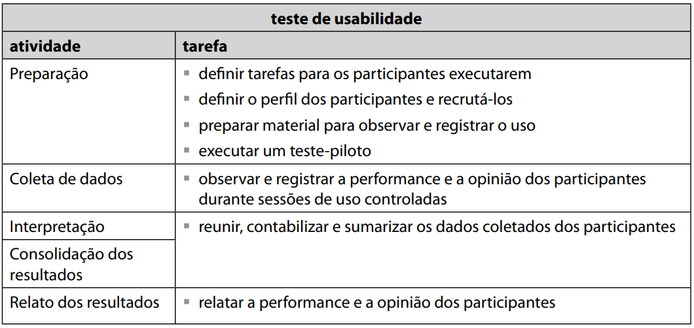

# Protótipo de Baixa-fidelidade

## Metodologia

Qualquer coisa que possibilite que os stakeholders interajam com o produto imaginado visando adquirir alguma experiência de como utilizá-lo em um ambiente real e a explorar usos para ele imaginados.O método de prototipação de baixa fidelidade tem o intuito viabilizar a concretização do brainstorm de forma simples e com baixo custo.
Avaliaremos por meio de um teste-piloto e, com isso, aplicaremos a metodologia que está na tabela abaixo.

## Protótipo

<iframe src="https://philipeserafim26463.invisionapp.com/freehand/IHC-2021-1-efWmcS6lp" title="Sample" width="560" height="560">
</iframe>

| Versão | Data       | Modificação          | Autor      |
| ------ | ---------- | -------------------- | ---------- |
| 1.0    | 17/09/2021 | Criação do Documento | Pedro Lima |
