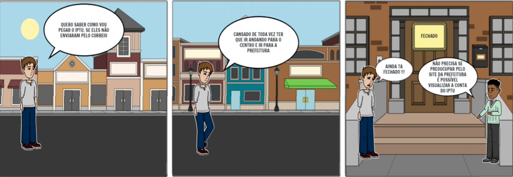
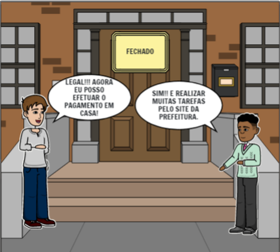
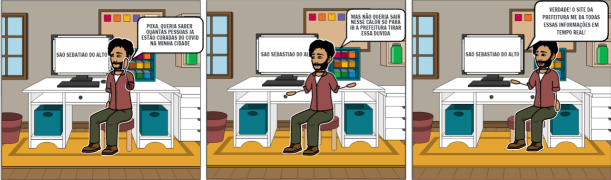
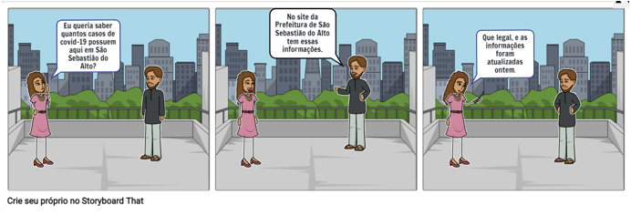
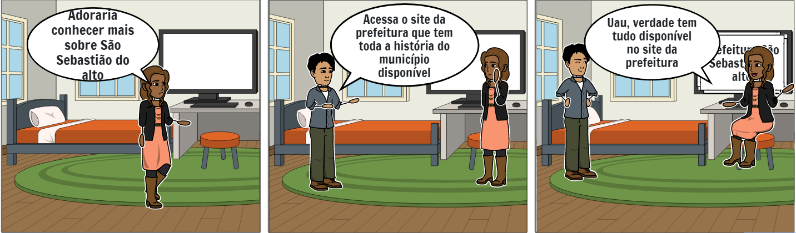

##  Introdução

O <a>storyboard</a> é considerado um exemplo de prototipação de baixa-fidelidade, geralmente utilizado em conjuntos de cenários. Consiste em uma série de desenhos mostrando como o usuário pode progredir em uma tarefa utilizando o produto que esta sendo desenvolvido. Devendo apresentar quais as pessoas envolvidas, quais são os passos que essas pessoas devem fazer para realizar a tarefa, e por fim, apresentar o que motivou essas
pessoas a usarem a aplicação.

## Objetivo

O storyboard ajuda a fornecer detalhes da aplicação de maneira simples e eficiente, através de um protótipo. Fazendo o usuário percorrer pelo cenário e ter uma ideia do que o projeto vai ser nas versões finais.

## Storyboards

Com os storyboards abaixo, verificamos bomo a presença ou a ausência do site influencia na vida desses usuários, ilustrando um cenário elaborado dessa situação específica em que o usuário irá utilizar o sistema.

## Storyboard - 1

O storyboard abaixo relata um cenário em que o cidadão precisa resolver o pagamento do iptu, porém não queria ter que ir para a prefeitura apenas para resolver essa situação.

<figcaption>Figura 1 - Storyboard IPTU. Autor: Gabriel Avelino</figcaption>

 

<figcaption>Figura 1.2 - Storyboard IPTU (continuação). Autor: Gabriel Avelino</figcaption>

## Storyboard - 2

O storyboard abaixo relata um cidadão querendo ver o boletim informativo COVID-19

<figcaption>Figura 2 - Storyboard Boletim COVID. Autor: Gabriel Avelino</figcaption>

 

## Storyboard - 3

O relato abaixo ocorre de maneira similar ao storyboard acima, aonde a cidadã preocupada com a situação do COVID-19 na cidade, quer saber o número de casos que ocorreram.

<figcaption>Figura 3 - Storyboard COVID-19. Autor: Ítalo Serra</figcaption>

## Storyboard - 4

Com o storyboard abaixo, uma visitante do município deseja conhecer a cidade, para isso, o site da prefeitura disponibiliza a história da cidade. Conhecendo o site pela primeira vez, relatando o primeiro contato com o site.

<figcaption>Figura 4 - Storyboard História. Autor: Gabriel Avelino</figcaption>

 

## Referências bibliográficas

> Barbosa, S. D. J.; Silva, B. S. da; Silveira, M. S.; Gasparini, I.; Darin, T.; Barbosa, G. D. J. (2021) Interação Humano-Computador e Experiência do usuário. Autopublicação.

## Versionamento

| Versão | Data | Modificação | Autor |
|--|--|--|--|
| 1.0 | 10/09/2021 | Criação do documento | Gabriel Avelino |
| 1.0 | 10/09/2021 | Criação do storyboard 1 | Gabriel Avelino |
| 1.0 | 10/09/2021 | Criação do storyboard 2 | Gabriel Avelino |
| 1.0 | 10/09/2021 | Criação do storyboard 3 | Ítalo Serra |